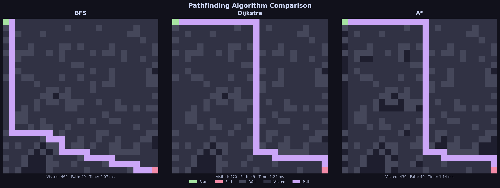

# 🗺️ Pathfinding Algorithm Visualizer

An interactive browser-based tool that animates **BFS**, **Dijkstra**, and **A\*** on both square and hexagonal grids. Draw walls, place start/end points, and watch the algorithms explore in real time.

**[▶ Live Demo (Square Grid)](https://sidharthkris.github.io/pathfinding-visualizer/index.html)** · **[⬡ Live Demo (Hex Grid)](https://sidharthkris.github.io/pathfinding-visualizer/hex.html)**



---

## ✨ Features

- **Two grid environments** — classic square grid and hexagonal grid
- **Three algorithms** implemented from scratch — BFS, Dijkstra, A\*
- **Live animation** with adjustable speed (1× crawl → 5× instant)
- **Interactive drawing** — paint walls, move start/end, right-click to erase
- **Maze generator** for quick obstacle layouts
- **Real-time stats** — cells visited, path length, elapsed time
- **Zero dependencies** — pure HTML/CSS/JS, no frameworks

---

## 🧠 How Each Algorithm Works

Understanding these three algorithms is key to knowing *when* to use each one. They all solve the same problem — finding a route from A to B — but differ in *how* they explore the graph.

---

### 🔵 Breadth-First Search (BFS)

**Core idea:** Explore every neighbour one step away before moving two steps away. Like ripples spreading outward from a stone dropped in water.

**How it works:**
1. Put the start cell in a **queue** (first-in, first-out).
2. Take the cell at the front of the queue.
3. Add all its unvisited neighbours to the *back* of the queue.
4. Repeat until the end cell is reached.

Because every step costs the same (1 move), the first time BFS reaches a cell it has found the shortest path to it. The path is reconstructed by following the chain of "came from" pointers back to the start.

```
Queue: [Start]
Step 1: Visit Start  → add its neighbours → Queue: [A, B, C]
Step 2: Visit A      → add A's neighbours → Queue: [B, C, D, E]
...continues layer by layer until End is found
```

**Guarantees:** ✅ Shortest path (on unweighted grids) · ✅ Always finds a path if one exists  
**Weakness:** Explores in all directions equally — wastes effort on cells far from the goal  
**Time complexity:** O(V + E) where V = cells, E = edges

---

### 🟡 Dijkstra's Algorithm

**Core idea:** Always visit the *cheapest* unvisited cell next. The generalization of BFS to weighted graphs.

**How it works:**
1. Assign every cell a distance of ∞, except the start (distance = 0).
2. Put the start in a **priority queue** (min-heap), sorted by distance.
3. Pop the cell with the lowest distance.
4. For each neighbour, calculate: `new_distance = current_distance + edge_weight`.
5. If `new_distance` is better than what we recorded, update it and push to the queue.
6. Repeat until the end cell is popped.

On a uniform grid (all edges cost 1), Dijkstra behaves identically to BFS. Its power shows on *weighted* graphs — e.g. road networks where highways are faster than side streets.

```
dist[Start] = 0, all others = ∞
Priority queue: [(0, Start)]
Pop (0, Start) → update neighbours → queue: [(1,A),(1,B),(1,C)]
Pop (1, A)     → update A's neighbours ...
```

**Guarantees:** ✅ Optimal path on weighted graphs · ✅ Always finds a path if one exists  
**Weakness:** Still explores in all directions — no sense of where the goal is  
**Time complexity:** O((V + E) log V) with a binary heap

---

### 🟣 A\* (A-Star)

**Core idea:** Dijkstra + a *heuristic* that estimates how far each cell is from the goal. This guides the search toward the destination instead of spreading blindly.

**How it works:**

Each cell gets a score: **f(n) = g(n) + h(n)**

| Term | Meaning |
|------|---------|
| `g(n)` | Actual cost from start to cell `n` (known) |
| `h(n)` | *Estimated* cost from `n` to end (heuristic) |
| `f(n)` | Total estimated cost of path through `n` |

The algorithm always expands the cell with the **lowest f(n)** first — just like Dijkstra, but with the heuristic pulling it toward the goal.

**Manhattan heuristic** (used here for square grids):
```
h(n) = |n.row - goal.row| + |n.col - goal.col|
```

**Hex grid heuristic** (axial coordinates):
```
h(n) = (|Δq| + |Δr| + |Δq + Δr|) / 2
```

Because the heuristic is *admissible* (never overestimates the true cost), A\* is guaranteed to find the optimal path — just wastes far fewer steps getting there.

**Guarantees:** ✅ Optimal path · ✅ Fewest explored cells among these three  
**Weakness:** Requires a good heuristic; on fully random mazes behaves like Dijkstra  
**Time complexity:** O(E log V) — in practice much faster than Dijkstra on open grids

---

### 📊 Side-by-Side Comparison

| Property | BFS | Dijkstra | A\* |
|----------|:---:|:--------:|:---:|
| Finds shortest path | ✅ (unweighted) | ✅ | ✅ |
| Works on weighted graphs | ✗ | ✅ | ✅ |
| Uses a heuristic | ✗ | ✗ | ✅ |
| Cells explored (typical) | Most | Most | Fewest |
| Best for | Simple grids | Weighted maps | Any grid, fast |

> **On a 20×20 grid (22% obstacles, seed=0):** BFS visited **469** cells, Dijkstra **470**, A\* only **430** — all finding the same optimal path of **49 steps**.

---

## 🚀 Getting Started

### Option A — Open directly in browser
```
index.html   →  square grid
hex.html     →  hexagonal grid
```
Just open either file locally — no server required.

### Option B — Python CLI (batch output)
```bash
pip install -r requirements.txt
python visualizer.py                        # default 20×20, all algorithms
python visualizer.py --size 30 --seed 7
python visualizer.py --algo astar
```

| Flag | Default | Description |
|------|---------|-------------|
| `--size` | `20` | Grid dimension (N×N) |
| `--seed` | `42` | Random seed |
| `--obstacles` | `0.28` | Obstacle density (0–1) |
| `--algo` | `all` | `bfs` · `dijkstra` · `astar` · `all` |
| `--output` | `pathfinding_comparison.png` | Output file |

---

## 📁 Project Structure

```
pathfinding-visualizer/
├── index.html                  # Square grid GUI
├── hex.html                    # Hex grid GUI
├── visualizer.py               # CLI batch tool (PNG output)
├── pathfinding_comparison.png  # Sample output image
├── requirements.txt
└── README.md
```

---

## 🔗 Related

This project complements my master's thesis on [emergency evacuation simulation](https://github.com/Sidharthkris/emergency-evacuation-simulation), where agent pathfinding under crowd pressure is a central modelling challenge.

---

## 📄 License

MIT — free to use, adapt, and build upon.
